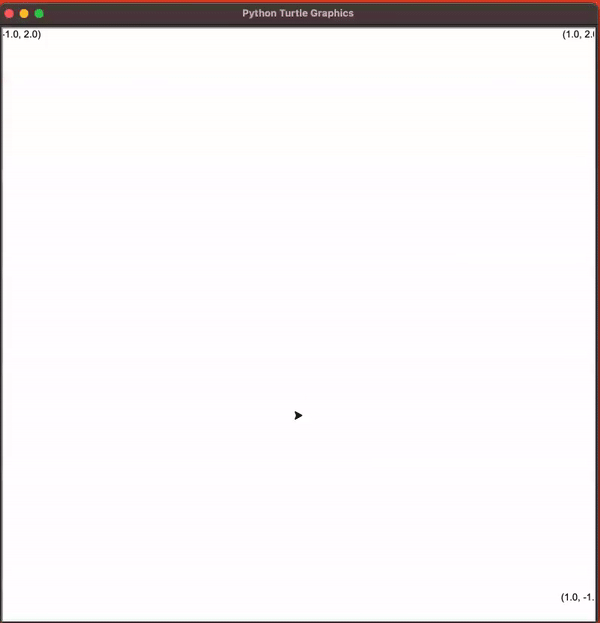

# Kalman Filters 

## Background

Kalman Filters, or linear quadratic estimators (LQEs), predict future motion by computing joint-probability gaussian distributions. 

The filter operates using weighted averages of state variables and measurements, where weights are calculated from covariances and a supplied `Kalman gain` learning hyperparameter. 

The state variables are as follows:

`F` : state-transition model
`H` : observation model 
`Q` : covariance of process (movement) noise
`R` : covariance of observation (measurement) noise 
`u` : optional control-input model

From there, state at time `t+1` is calculated as `x_{t+1} = F_t x_{t-1}  + B_t u_t + w_t`

## Task
The premise of this assignment was to predict the motion of a falling meteorite using a 2D Kalman Filter. Using the filter's predictions, I was then tasked with writing an algorithm for aiming a turret to eliminate the meteroites before they intercepted the x axis.

The motion model of the meteorites were assumed to follow a straightforwad parabolic pattern with the following caveats:
- the x position was subject to an acceleration constant not present in the y plane
- velocity in the x plane was subject to nonzero acceleration that was correlated to acceleration in the y plane

Ultimately, those caveats simplified the filter a bit since only one dimenion was required to model acceleration for the F component matrix. From there, estimation and state updates were addressed by relatively straightforward matrix multiplication.

For the turret manipulation portion, I found a simple sweeping algorithm to work sufficiently with a few optimizations to account to the turret's limited reach and angular movement per turn.

Generally speaking, the Kalman estimator was able to get a close estimate for most points despite measurement noise:

That said, those noisy estimates were more pronounced when it came time to try to eliminate the meteroites:

