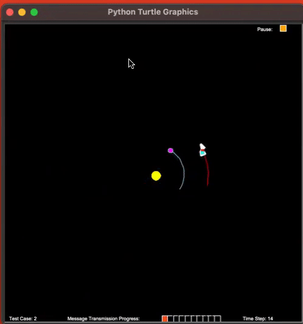

# Particle Filters 

## Background

Slightly more intuitive than Kalman Filters, Particle Filters work by initializing a set of guesses for the object's true position and resampling from that set according to a likelihood distribution to form a more targeted sample as observations are made. 

## Task
This assignment focused on localization in the context of an object in gravitational orbit. Rather than using a series of landmarks to localize, one measurement was given at each timestep (total gravitational force), which was then compared against total force calculations at each of the particles. From there, particles were resampled (with replacement) with weights corresponding to their Gaussian probability of being the true location of the target. Finally, an estimate was calculated by projecting a weighted average of the resampled particles's positions 1 timestep into the future.

To test whether the filter was consistently close to the target, this assignment had a secondary component where I needed to determine an angle to send a transmission back to a planet with a known location:

